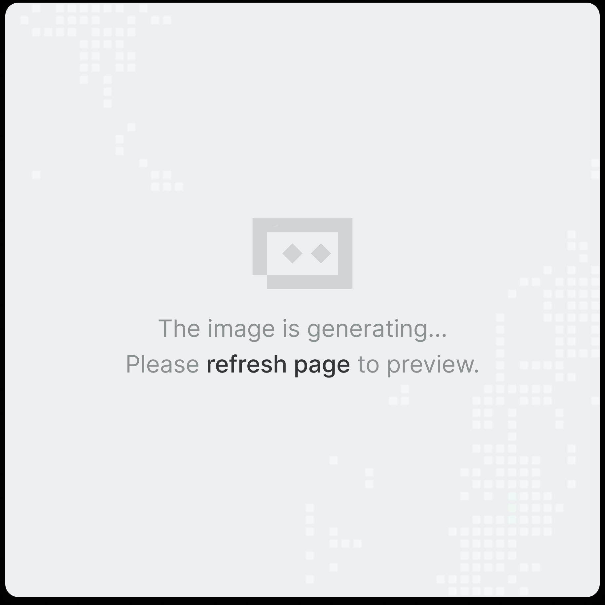
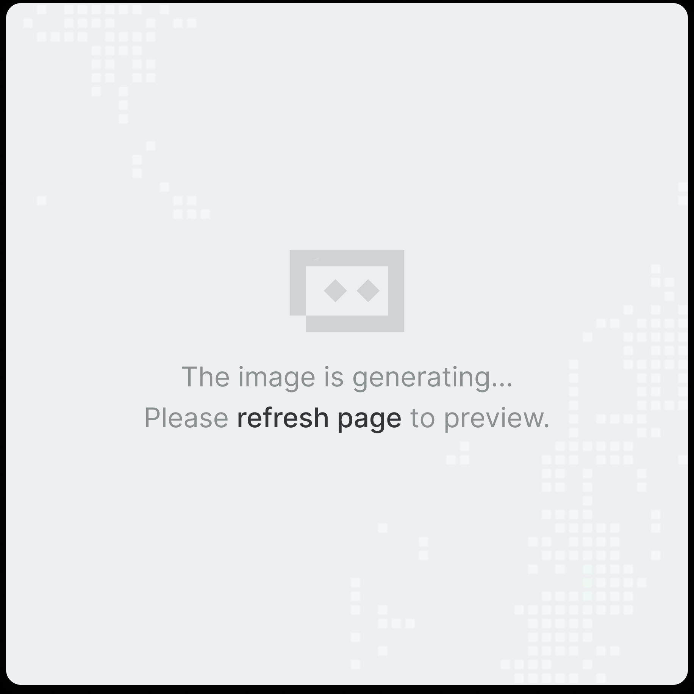
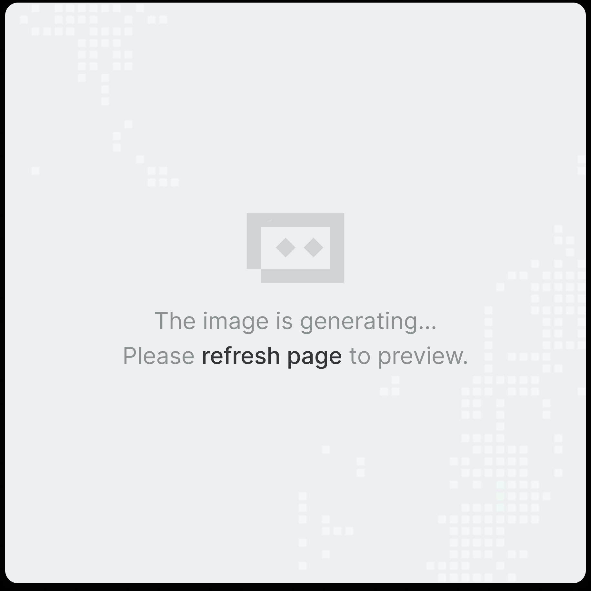

# 🚀 Voyager — AI 智能旅行助手

> *Voyager = 旅行者。输入目的地，AI Agent 团队帮你规划一切。*

[](LICENSE)
[](https://vuejs.org/)
[](https://fastapi.tiangolo.com/)
[](https://www.python.org/)
[](https://www.typescriptlang.org/)

---

## 📖 简介

做旅行攻略太累了 — 查景点、刷天气、比酒店、排路线... 信息碎片化严重，一份靠谱的行程往往需要 2-3 小时。

**Voyager** 是一个基于 **Multi-Agent 架构** 的 AI 旅行规划系统。你只需输入目的地、天数和偏好，背后 4 个 AI Agent 会像专业旅行顾问团队一样并行协作 — 搜索景点、查询天气、推荐住宿，最后由 Planner Agent 综合决策，一键生成包含每日行程、地图路线、预算估算的完整旅行计划。

**30 秒模板秒出 + LLM 深度规划**，覆盖全国所有城市。

---

## ✨ Demo

| 首页输入 | 流式规划进度 | 结果页 + 地图 | 多方案对比 |
|:---:|:---:|:---:|:---:|
|  |  |  |  |

- **首页** — 输入城市 / 天数 / 偏好，支持自定义标签（美食、文化、自然风光...）
- **规划进度** — 3 个专家 Agent 实时并行搜索，SSE 流式反馈进度
- **结果页** — 多日行程卡片 + 高德贝塞尔弧线地图 + 预算明细 + PDF/日历导出
- **多方案对比** — 同时生成经济型 / 舒适型 / 豪华型 3 套方案，一键切换

---

## 🎯 核心亮点

| 亮点 | 说明 |
|------|------|
| 🤖 **Multi-Agent 协作** | 景点 / 天气 / 酒店 3 个 Agent 并行获取数据，Planner Agent 统一决策 |
| ⚡ **双模式规划** | 热门城市模板秒出 + LLM Function Calling 实时深度规划 |
| 🗺️ **贝塞尔弧线地图** | 高德地图 + BezierCurve，景点间弧线路径 + 方向箭头，告别生硬直线 |
| 🌧️ **天气智能适配** | 雨天自动替换室内景点，高温时段避开正午暴晒 |
| 💰 **商业化闭环** | CPS 联盟链接（携程/去哪儿/飞猪） + 分享 Token + ICS 日历导出 |
| 🐳 **一键部署** | Docker Compose 一行命令启动，nginx SPA 路由 + API 反向代理 |

---

## 🏗️ 系统架构

```
┌──────────────────────────────────────────────────────────┐
│                    用户界面 (Vue 3 + Vite)                  │
│          Home → Result → Comparison → Share → Favorites    │
└───────────────────────┬──────────────────────────────────┘
                        │ HTTP / REST
                        ▼
┌──────────────────────────────────────────────────────────┐
│                    API 层 (FastAPI)                        │
│   POST /plan  │  POST /edit  │ POST /plan/variants       │
│   GET /list   │  POST /favorite  │ GET /share/{token}    │
└───────────────────────┬──────────────────────────────────┘
                        │
                        ▼
┌──────────────────────────────────────────────────────────┐
│              Agent 协作层 (Multi-Agent)                     │
│  ┌────────────┐  ┌────────────┐  ┌────────────┐         │
│  │ Attraction │  │  Weather   │  │   Hotel    │  ← 并行  │
│  │   Agent    │  │   Agent    │  │   Agent    │         │
│  └─────┬──────┘  └─────┬──────┘  └─────┬──────┘         │
│        └────────────────┼────────────────┘                │
│                         ▼                                │
│                ┌──────────────┐                          │
│                │   Planner    │  ← Function Calling       │
│                │    Agent     │                          │
│                └──────────────┘                          │
└───────────────────────┬──────────────────────────────────┘
                        │
                        ▼
┌──────────────────────────────────────────────────────────┐
│                  工具层 (MCP + API)                        │
│  高德 POI  │  高德天气  │  Unsplash  │  MiMo LLM          │
└──────────────────────────────────────────────────────────┘
```

---

## 🚀 快速开始

### 环境要求
- Node.js >= 18
- Python >= 3.12
- 高德地图 API Key（可选，无则使用 LLM 离线模式）
- OpenAI-compatible API Key（支持小米 MiMo / DeepSeek / OpenAI 等）

### 一键启动

```bash
git clone https://github.com/14sword/voyager.git
cd voyager

# 配置环境变量
cd backend && cp .env.example .env
# 编辑 .env 填入 API Key

# 启动
chmod +x start.sh && ./start.sh
```

### Docker 部署

```bash
docker compose up -d
```

访问 **http://localhost:5173** 即可使用。

---

## 📋 功能全览

### 规划引擎
| 功能 | 说明 |
|------|------|
| 智能行程生成 | 输入城市 + 天数 + 偏好，LLM Function Calling 生成结构化行程 |
| 模板秒出 | 北京 / 上海 / 成都预置精品模板，输入即出 |
| 多方案对比 | 同时生成经济 / 舒适 / 豪华 3 套方案 |
| 行程编辑 | 灵活调整行程顺序和内容 |
| 预算自动计算 | 按交通 / 住宿 / 餐饮 / 门票自动汇总 |

### 地图与交互
| 功能 | 说明 |
|------|------|
| 贝塞尔弧线路径 | 景点间弧形连接线 + 方向箭头 |
| 天气智能适配 | 雨天室内景点 / 高温避开正午 / 低温调整户外活动 |
| 景点深度内容 | 100-150 字介绍 + 历史背景 + 拍照打卡点 + 实用 Tips |
| 流式进度反馈 | SSE 实时推送 Agent 搜索进度 |

### 商业化
| 功能 | 说明 |
|------|------|
| CPS 联盟链接 | 携程 / 去哪儿 / 飞猪 / 机票比价链接 |
| 分享 H5 页面 | 生成 Token，一键分享给朋友 |
| 收藏管理 | 后端持久化收藏列表 |
| ICS 日历导出 | 行程同步到手机日历 |
| PDF 导出 | CDN 动态加载 html2pdf.js，一键导出 |

### 工程化
| 功能 | 说明 |
|------|------|
| SQLite 持久化 | 纯 Python sqlite3，零外部依赖 |
| 用户认证 | JWT 注册 / 登录 |
| 多阶段 Docker | backend + frontend build + nginx |
| CORS 安全 | 精确控制跨域访问 |

---

## 🧠 Agent 系统设计

### 工作流程

```
用户输入 (城市 / 天数 / 偏好)
    │
    ▼
┌─────────────────────────────┐
│  并行调用 3 个专业 Agent      │
│  ├─ AttractionAgent → 景点  │
│  ├─ WeatherAgent → 天气     │
│  └─ HotelAgent → 酒店       │
└─────────────┬───────────────┘
              │ 汇总数据
              ▼
┌─────────────────────────────┐
│  PlannerAgent               │
│  ├─ 综合景点 / 天气 / 酒店   │
│  ├─ 按地理位置优化路线       │
│  ├─ 天气适配调整             │
│  └─ Function Calling 输出    │
│     结构化 JSON              │
└─────────────────────────────┘
```

### Agent 职责

| Agent | 职责 | 数据源 | 容错 |
|-------|------|--------|------|
| **Attraction Agent** | 搜索目的地热门景点 | 高德 POI + LLM 知识 | MCP 不可用时用 LLM 自身知识 |
| **Weather Agent** | 查询行程期间天气 | 高德天气 API | 同上 |
| **Hotel Agent** | 推荐酒店住宿 | 高德 POI 搜索 | 同上 |
| **Planner Agent** | 综合决策生成行程 | 无（纯推理） | JSON 解析失败时宽松构建 |

### 关键实现

- **Function Calling** — LLM 通过预定义 JSON Schema 输出结构化行程
- **MCP 协议** — Agent 通过 Model Context Protocol 调用高德地图 API
- **JSON 修复** — 多层解析（直接解析 → 正则提取 → 尾部逗号修复 → 逐对象提取）
- **安全截断** — 返回超量天数自动截断

---

## 🛠️ 技术栈

### 前端
- **Vue 3** + TypeScript + Vite 5
- **Ant Design Vue 4** — 组件库
- **高德地图 JS API 2.0** — 地图 + 贝塞尔弧线
- **CDN 动态加载** — html2pdf.js 等

### 后端
- **FastAPI** + Python 3.12
- **SQLite** — 纯 Python sqlite3，零外部依赖
- **OpenAI-compatible API** — 接入 MiMo v2.5-pro 推理模型
- **MCP** — 标准化 Agent 工具调用
- **高德地图 REST API** — POI + 天气

### 基础设施
- **Docker** — 多阶段构建
- **nginx** — SPA 路由 + API 反向代理 + gzip

---

## 📂 项目结构

```
voyager/
├── backend/
│   ├── app/
│   │   ├── main.py              # FastAPI 入口
│   │   ├── config.py            # 环境变量配置
│   │   ├── database.py          # SQLite ORM（零依赖）
│   │   ├── api/routes.py        # API 路由（CRUD + 分享 + 收藏 + CPS）
│   │   ├── agents/
│   │   │   ├── trip_planner.py  # Multi-Agent 编排 + Function Calling
│   │   │   └── prompts.py       # Agent 系统提示词
│   │   ├── models/schemas.py    # Pydantic 数据模型
│   │   ├── services/
│   │   │   ├── llm.py           # LLM 服务（OpenAI 兼容）
│   │   │   ├── mcp_client.py    # MCP 客户端（高德地图）
│   │   │   └── unsplash.py      # 图片服务
│   │   └── templates.py         # 城市模板（北京/上海/成都）
│   ├── tests/test_routes.py     # 20 项 API 测试
│   └── requirements.txt
├── frontend-redesigned/
│   ├── src/
│   │   ├── views/
│   │   │   ├── Home.vue         # 首页（表单输入）
│   │   │   ├── Result.vue       # 结果页（行程 + 地图 + 导出）
│   │   │   ├── ComparisonView.vue # 多方案对比
│   │   │   ├── Favorites.vue    # 收藏列表
│   │   │   ├── Share.vue        # 分享 H5 页面
│   │   │   └── Auth.vue         # 登录/注册
│   │   ├── services/api.ts      # API 接口封装
│   │   ├── router/index.ts      # 路由配置
│   │   └── types/index.ts       # TypeScript 类型
│   └── package.json
├── Dockerfile                    # 多阶段构建
├── docker-compose.yml
├── nginx.conf                    # SPA + 反向代理
└── start.sh                      # 一键启动脚本
```

---

## 🔌 API 接口

| 方法 | 路径 | 说明 |
|------|------|------|
| `POST` | `/api/trip/plan` | 生成旅行计划 |
| `POST` | `/api/trip/edit` | 编辑旅行计划 |
| `POST` | `/api/trip/plan/variants` | 多方案对比 |
| `GET` | `/api/trip/list` | 行程列表 |
| `GET` | `/api/trip/{trip_id}` | 行程详情 |
| `DELETE` | `/api/trip/{trip_id}` | 删除行程 |
| `GET` | `/api/trip/share/{token}` | 分享链接访问 |
| `POST` | `/api/trip/favorite/{trip_id}` | 添加收藏 |
| `DELETE` | `/api/trip/favorite/{trip_id}` | 取消收藏 |
| `GET` | `/api/trip/favorites/list` | 收藏列表 |
| `POST` | `/api/auth/register` | 用户注册 |
| `POST` | `/api/auth/login` | 用户登录 |

---

## 📜 License

MIT License © [14sword](https://github.com/14sword)

---

⭐ **如果这个项目对你有帮助，欢迎 Star！**